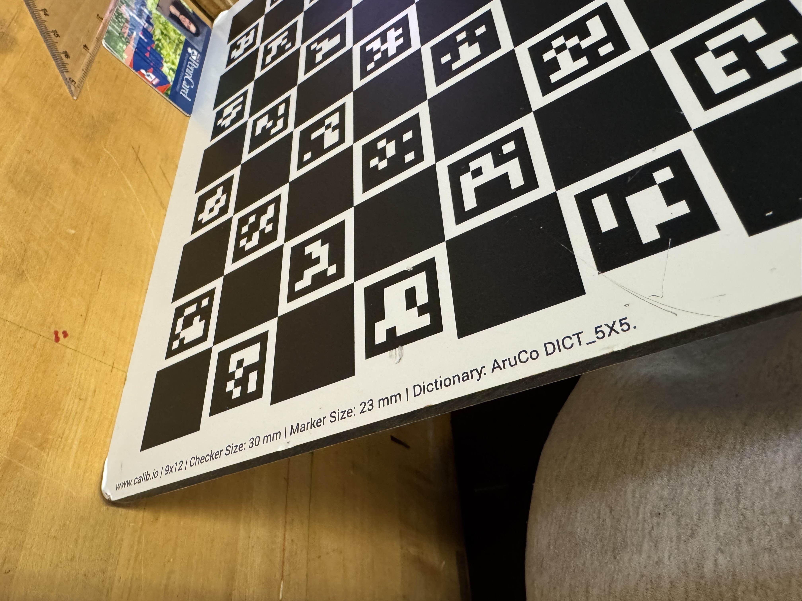
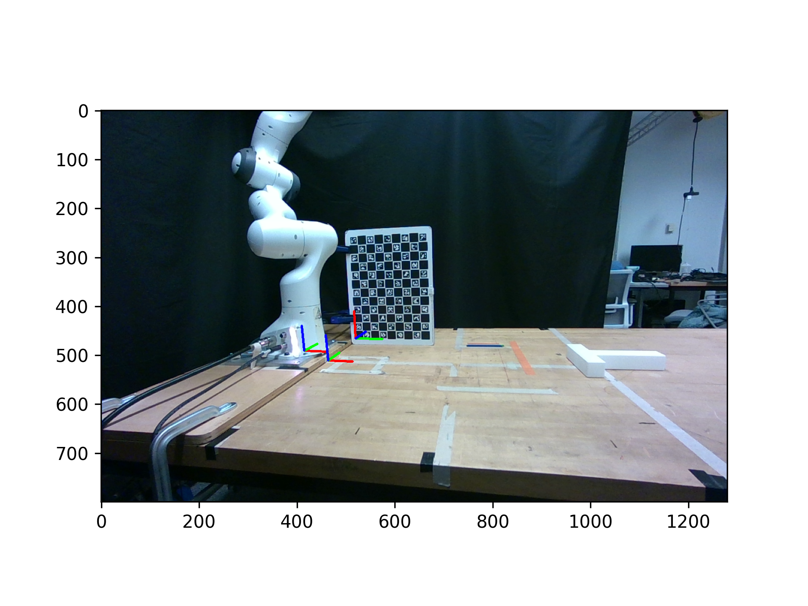
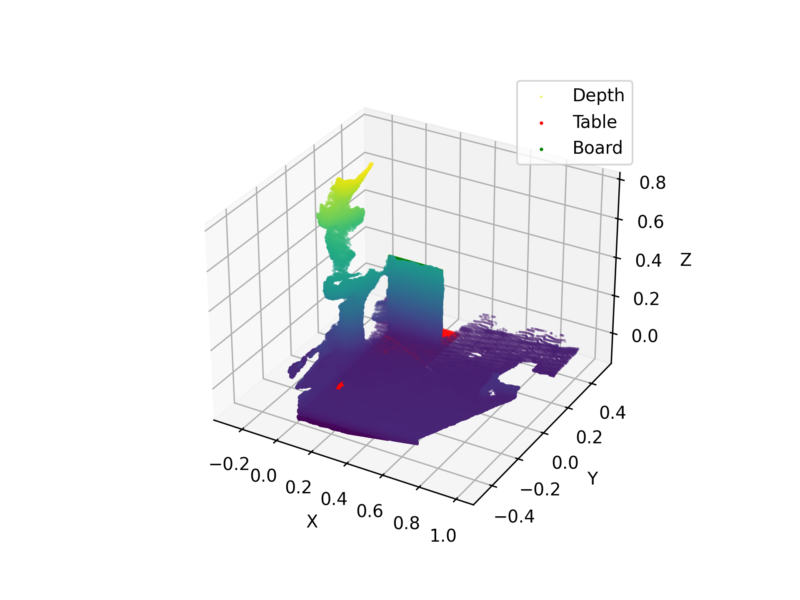
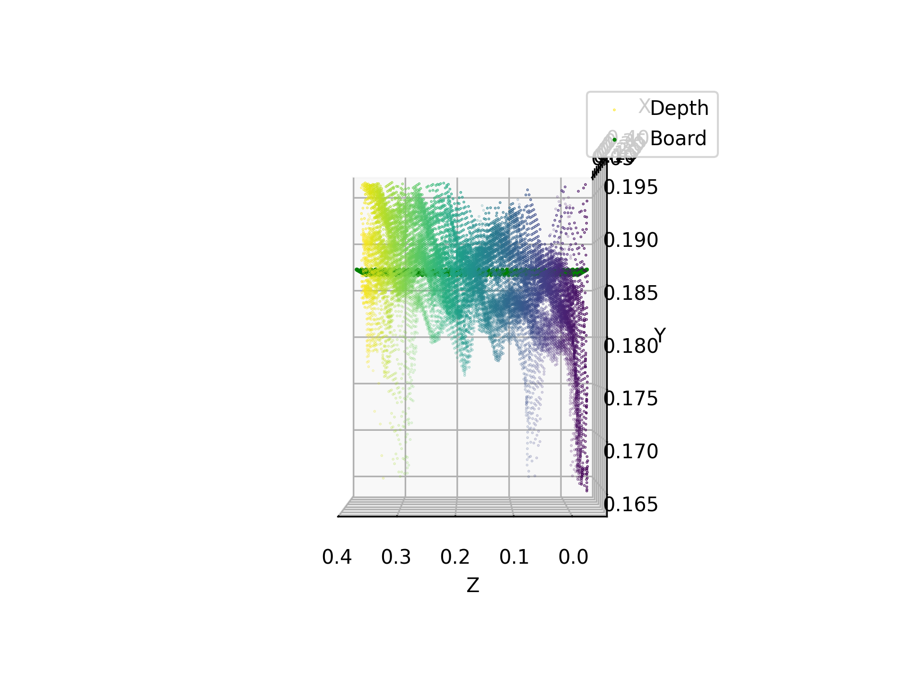
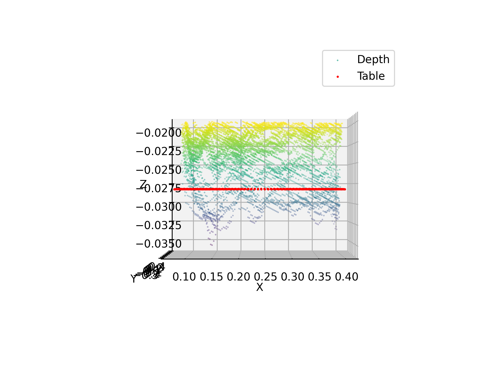

# ci_mpc_utils
Personal scripts for contact-implicit MPC project

## Camera Calibration

The camera calibration script, [camera_calibration.py](./camera_calibration.py), is used to perform extrinsic camera calibration and to store the camera intrinsic parameters reported by the camera.  Run via:
```
python camera_calibration.py
```

This computes the relative transform between a camera and the world.  Currently this script requires:
 - The calibration board is an Aruco board with the below description:
    
 - The calibration board is located at a known pose in the world, defined in the script and pictured in the example debug photo below.
 - The camera is a RealSense D455 plugged into the computer via USB.

Here's an example of the output debug image from a calibration, with the board in its hard-coded location relative to the robot (i.e. world) frame.


For inspecting the alignment, the script also generates 3D plots to compare the depth returns to known geometries (the calibration board and the table).  Examples:




The outputs of the calibration script are saved into a timestamped folder under the (git-ignored) `calibrations/` directory.
