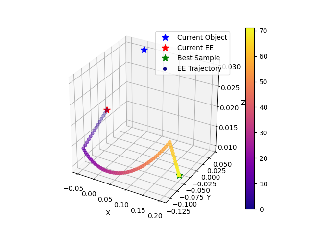
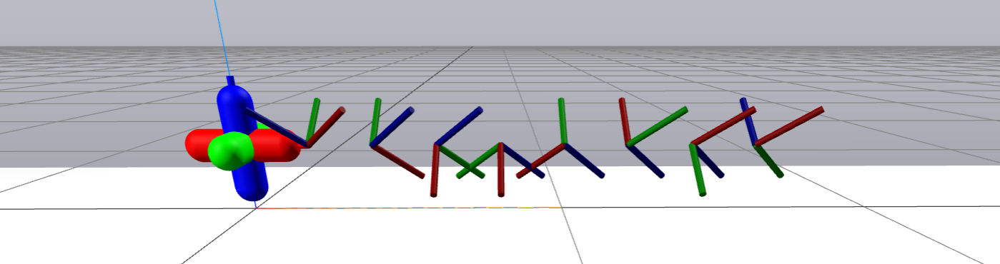

# Contact-Implicit MPC Utilities
Personal scripts for contact-implicit MPC project, including:

 1. [Camera calibration](#camera-calibration)
 2. [Quaternion Hessian-based cost matrix](#quaternion-hessian-based-cost-matrix)
 3. [Arc repositioning](#arc-repositioning)
 4. [Quaternion visualization](#quaternion-visualization)
 5. [LCS debugging](#lcs-debugging)


## Camera Calibration

The camera calibration script, [camera_calibration.py](./camera_calibration.py), is used to perform extrinsic camera calibration and to store the camera intrinsic parameters reported by the camera.  Run via:
```
python camera_calibration.py
```

This computes the relative transform between a camera and the world.  Currently this script requires:
 - The calibration board is an Aruco board with the below description:
    
 - The calibration board is located at a known pose in the world, defined in the script and pictured in the example debug photo below.
 - The camera is a RealSense D455 plugged into the computer via USB.

Here's an example of the output debug image from a calibration, with the board in its hard-coded location relative to the robot (i.e. world) frame.


For inspecting the alignment, the script also generates 3D plots to compare the depth returns to known geometries (the calibration board and the table).  Examples:


The outputs of the calibration script are saved into a timestamped folder under the (git-ignored) `calibrations/` directory.


## Quaternion Hessian-Based Cost Matrix

The scripts [quat_hessian_compute.py](./quat_hessian_compute.py) and [quat_hessian_test.py](./quat_hessian_test.py) derive and test, respectively, the 4x4 Hessian of the true squared angular error, given a current quaternion and a goal quaternion.  The purpose of these single-use files is to automatically generate the quaternion expressions before converting to C++ as part of the 4x4 block of the Q cost matrix corresponding to the quaternion over time.  This matrix is almost never PSD, so regularization is required.  The C++ implementation is located in [dairlib](https://github.com/DAIRLab/dairlib/tree/main) as `systems/controllers/quaternion_error_hessian.cc` on certain branches (as of 4/25/2025, the branch of interest is `sampling_based_c3_dev`).

For the $Q$ cost matrix, a typical diagonal structure is sufficient for position and velocity errors in our experiments.  However, orientation presents some challenges.  The true orientation error we desire to minimize is $\theta_\text{error}^2$, where $\theta_\text{error}$ is the scalar angle represented by the relative rotation between the current and goal orientations.  Most obviously, when $\theta_\text{error}$ is near $\pi$ radians (noting $\pi$ radians is the maximum possible $\theta_\text{error}$), rotating in any direction is equally effective, meaning indecision for what action to take is inevitable.  This is mitigated by truncating the orientation goal to something below $\pi$ radians (2 radians has worked well, in our experiments), with hysteresis on the rotation axis to ensure stability of the direction of rotation.

Even for small orientation errors, we note that the desired error $\theta_\text{error}^2$ is problematic when represented via quaternion coordinates. The error is calculated as

$$\theta_\text{error} = \left( \arctan \left( \frac{ \left\lVert {q\_{\text{rel},x}^2 + q\_{\text{rel},y}^2 + q\_{\text{rel},z}^2} \right\rVert }{q\_{\text{rel},w}} \right) \right)^2,$$

$$\text{where} \quad q\_\text{rel} = q\_\text{quat,curr}^{-1} \otimes q\_\text{quat,goal},$$

for $\otimes$ as quaternion product.  The $\arctan$ indicates a problematic region where its argument is zero -- this occurs precisely when $q_\text{quat,curr} = q_\text{quat,goal}$.  The landscape is not strictly convex at this point, and is non-convex in the local region.  Thus, the naive approximation to use the 2-norm error between the elements of $q_\text{quat,curr}$ and $q_\text{quat,goal}$,

$$\tilde{\theta}\_\text{error}^2 = \left\lVert {q\_\text{quat,curr} - q\_\text{quat,goal}} \right\rVert ^2.$$

poorly captures the true $\theta_\text{error}$ when it is small.  To address this, we set the 4x4 portion of $Q$ (throughout the entire MPC horizon) corresponding to the object quaternion to be the Hessian of $\theta_\text{error}^2$ with respect to the elements of the current quaternion, about the $q_\text{quat,curr}, q_\text{quat,goal}$ operating point.  Even restricted to errors below $\pi$ radians, this Hessian will contain a zero or negative eigenvalue, since scaling $q_\text{quat,curr}$ does not impact $\theta_\text{error}$.  We regularize $Q$, adding $\gamma \cdot \mathbb{I}_{4\times4}$, where $\gamma$ is the absolute value of the most negative eigenvalue of the Hessian to ensure positive-semi definiteness.  Implementing this portion of $Q$ was a critical step to effectively and reliably achieve orientation goals.


## Arc Repositioning

The arc repositioning test script, [arc_repositioning.py](./arc_repositioning.py), tests a repositioning strategy that follows an arc on a spherical surface.  The strategy first moves along a straight line colinear with the end effector's current location and the object's current location towards a specified repositioning radius away from the object, then follows a path along that spherical surface, then follows a straight line towards the sample.  The script has 3 hard-coded test cases, which can be selected by setting the `TEST_I` index.



## Quaternion Visualization

The quaternion visualization script, [quat_visualizer.py](./quat_visualizer.py), generates and visualizes the 8 stable orientations of the jack.  Renders the 8 quaternions as triads in a meshcat window, and prints out the C++ definitions for each of them.



## LCS Debugging

The LCS debugging script, [lcs_debugging.py](./lcs_debugging.py), runs some tests on a hard-coded set of LCS matrices to ensure their compatibility and the accuracy of the derivations.
